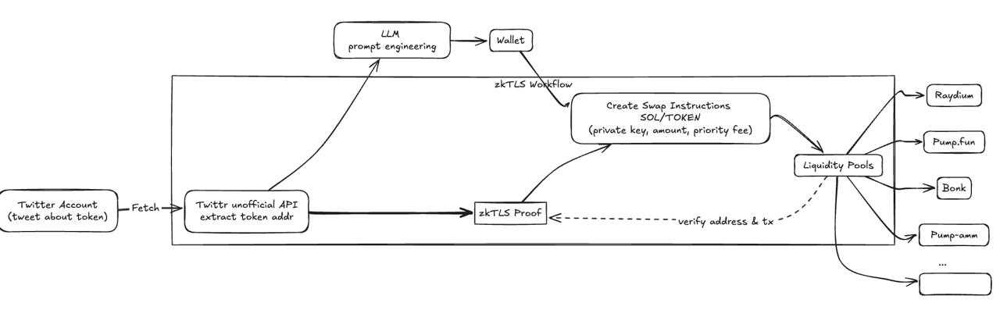

# trading-bot



## Setup instructions 


## Folder structure

```text
.
├── package.json
├── pnpm-lock.yaml
├── tsconfig.json
├── README.md
├── .env.example
└── src
    ├── index.ts
    ├── swap.ts
    ├── get-tweets.ts
    └── get-token-from-llm.ts
```

