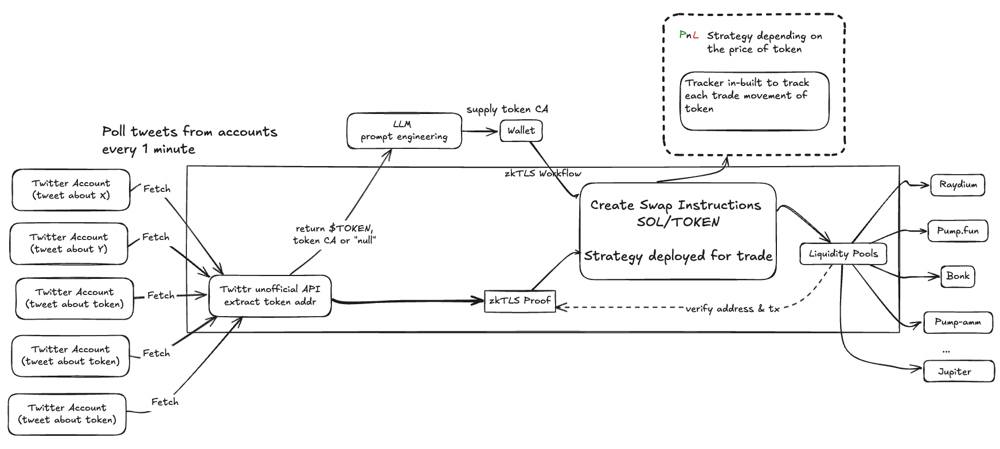

# trading-bot


Learn more about the project through the pitch deck - https://www.canva.com/design/DAGs3bg63_k/gNaGEV1HQV-7rUishWetng/edit?utm_content=DAGs3bg63_k&utm_campaign=designshare&utm_medium=link2&utm_source=sharebutton


## System architecture 



## Setup instructions

1. Clone the repository  
   ```bash
   git clone https://github.com/<your-user>/trading-bot.git
   cd trading-bot
   ```

2. Install dependencies  
   ```bash
   pnpm install        # or: npm install / yarn install
   ```

3. Create and fill your environment file  
   ```bash
   cp .env.example .env
   #   PRIVATE_KEY=         # base-58 Solana key
   #   RPC_URL=             # your RPC endpoint
   #   OPENAI_API_KEY=
   #   PUMP_API_KEY=
   #   RAPID_API_KEY=
   #   ZKTLS_APP_ID=
   #   ZKTLS_APP_SECRET=
   ```

4. Build and run the bot  
   ```bash
   pnpm build && pnpm start
   ```

## Folder structure

```text
.
├── package.json
├── pnpm-lock.yaml
├── tsconfig.json
├── README.md
├── .env.example
└── src
    ├── index.ts
    ├── swap.ts
    ├── get-tweets.ts
    ├── market-feed.ts
    ├── strategy.ts
    ├── positions.ts
    ├── get-token-from-llm.ts
    ├── zktls.ts
    └── users-list.ts
```

